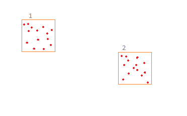

# Android Application Development Testing

Mohon kumpulkan tugas dengan source code-nya melalui akun GitHub Anda.


## 1. Uji kemampuan teknis menggabungkan penggunaan canvas, SQLite, dan manipulasi elemen UI.

Catatan: Pastikan Anda memiliki pengetahuan dasar tentang pengembangan aplikasi Android dan telah menyiapkan proyek Android Studio.

1. Buat Database SQLite:
- Tentukan tabel untuk menyimpan data titik (x, y).
```
CREATE TABLE IF NOT EXISTS points (
    id INTEGER PRIMARY KEY AUTOINCREMENT,
    x REAL,
    y REAL
);
```
2. Inisialisasi Database
- Buat kelas DatabaseHelper untuk membantu dalam manajemen database.
- Isi database dengan random point seusai luas canvas 

3. Buat Model Point:
- Definisikan model untuk merepresentasikan titik pada canvas.

4. Manipulasi Canvas dan Tampilan:
- Buat kelas CanvasView yang merupakan subclass dari View untuk menggambar titik dan memanipulasi persegi di atas canvas. 

5. Aktivitas Utama:
- sediakan input posisi untuk membuat persegi pada canvas dengan ukuran sisi yang anda tentukan.
- seleksi titik pada database sesuai dengan range luas persegi.
- tampilkan titik yang berpotongan.



## 2. Pengembangan Aplikasi Google Calendar Sync
Catatan: Pada tugas ini, peserta diharapkan untuk membuat aplikasi Android sederhana yang memungkinkan pengguna untuk menambahkan event baru ke Google Calendar dan membaca daftar event yang sudah ada. Peserta dapat menggunakan API resmi Google Calendar untuk mencapai ini.

1. Menambahkan Event Baru:
- Buat fitur untuk menambahkan event baru ke Google Calendar. 
- Event harus memiliki setidaknya informasi dasar seperti judul, deskripsi, tanggal, dan waktu. 
- Pastikan bahwa pengguna dapat memasukkan informasi ini melalui User Interface.

2. Membaca Daftar Event:
- Aplikasi harus dapat menampilkan daftar event yang sudah ada pada Google Calendar pengguna. 
- Peserta dapat menggunakan komponen UI seperti RecyclerView untuk menampilkan daftar event dengan baik.

3. Otentikasi Pengguna:
- Pastikan bahwa aplikasi meminta izin otentikasi dari pengguna untuk mengakses Google Calendar. 
- Peserta harus mengimplementasikan autentikasi OAuth 2.0 menggunakan Google Sign-In atau mekanisme otentikasi lainnya yang sesuai.

4. Error Handling:
- Peserta diharapkan untuk menangani kemungkinan kesalahan, seperti ketidakmampuan untuk terhubung ke Google Calendar atau kesalahan saat menambahkan event. 
- Berikan umpan balik yang sesuai kepada pengguna.

5. Optimasi Kinerja:
- Pastikan bahwa aplikasi dioptimalkan untuk kinerja dengan menghindari pemanggilan API yang berulang-ulang dan mempertimbangkan implementasi caching untuk mengurangi waktu respons.

## 3. Visualisasi Data
Catatan : Mengintegrasikan grafik menggunakan MPAndroidChart ke dalam aplikasi.
1. Integrasi MPAndroidChart:
- Integrasikan perpustakaan MPAndroidChart ke dalam proyek Android menggunakan dependensi yang sesuai.
2. Inisialisasi Grafik:
- Inisialisasikan objek grafik batang (BarChart) dalam sebuah aktivitas atau fragmen.
3. Isi Data Grafik:
- Tambahkan data ke dalam line chart. Gunakan contoh data blood pressure (systole & diastole) seorang pasien.
4. Atur Warna dan Tampilan:
- Sesuaikan warna dan tampilan grafik, termasuk warna garis, garis batas, dan judul grafik.
5. Aktifkan Interaksi:
- Aktifkan interaksi pengguna pada grafik, seperti zoom in/out dan sentuhan untuk menampilkan informasi detail.
6. Kustomisasi Label Axis:
- Sesuaikan label pada sumbu X dan Y untuk memberikan informasi yang jelas dan informatif.